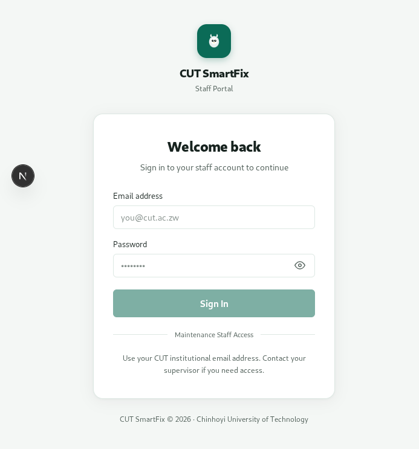
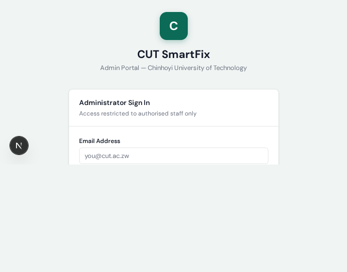
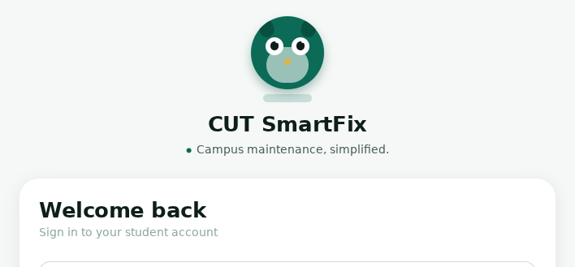

# CUT SmartFix



**A campus maintenance and facilities management platform for Chinhoyi University of Technology.**

CUT SmartFix connects students, maintenance staff, supervisors, and administrators through one secure workflow:

> Report → Review → Prioritize → Assign → Repair → Verify → Confirm → Analyse

## Product surfaces

| Surface        | Technology                           | Purpose                                                                         |
| -------------- | ------------------------------------ | ------------------------------------------------------------------------------- |
| Student mobile | React Native + Expo                  | Report issues, attach photos, track tickets, confirm repairs                    |
| Staff portal   | Next.js + TypeScript                 | Execute assigned work, add notes, request materials, submit evidence            |
| Admin portal   | Next.js + TypeScript                 | Manage requests, people, locations, taxonomy, analytics, and audit history      |
| Shared API     | Express + TypeScript                 | Authentication, authorization, workflows, storage, notifications, and reporting |
| Data platform  | Supabase PostgreSQL + Auth + Storage | Centralized relational data, identity, and private evidence files               |

## Repository layout

```text
apps/
	student-mobile/       Expo student application
	staff-portal/         Next.js technician and supervisor portal
	admin-portal/         Next.js administrator dashboard
services/
	api/                  Shared Express REST API
packages/
	contracts/            Shared domain and API types
	api-client/           Typed client helpers
supabase/
	migrations/           PostgreSQL schema, RLS, triggers, and seed data
docs/
	architecture.md      System boundaries and module map
	backend.md            API and database guide
	screenshots/          Product screenshots used in this README
```

## Requirements

- Node.js 20+
- pnpm 10+
- A Supabase project
- Expo CLI or Expo Go for mobile development

## Quick start

```bash
git clone <repository-url>
cd cut-smartfix
pnpm install
```

Create local environment files from the templates:

```bash
cp .env.example .env
cp services/api/.env.example services/api/.env
cp apps/student-mobile/.env.example apps/student-mobile/.env
```

Set Supabase values in the API environment. Only the API may contain `SUPABASE_SERVICE_ROLE_KEY`; never expose that key to Expo or a browser bundle.

Apply the database migrations:

```bash
supabase login
supabase link --project-ref <project-ref>
supabase db push
```

Start the workspace:

```bash
pnpm dev
```

| Service      | URL                       |
| ------------ | ------------------------- |
| REST API     | http://localhost:4000     |
| Staff portal | http://localhost:3000     |
| Admin portal | http://localhost:3001     |
| Student app  | Expo CLI output / Expo Go |

## Useful commands

```bash
pnpm typecheck
pnpm build
pnpm lint
pnpm --filter @cut-smartfix/api dev
pnpm --filter @cut-smartfix/staff-portal dev
pnpm --filter @cut-smartfix/admin-portal dev
pnpm --filter @cut-smartfix/student-mobile dev
```

## Roles and access

- `student`: create and track personal maintenance reports
- `technician`: view assigned tasks, update work, request materials, upload evidence
- `supervisor`: review, assign, verify, and oversee departmental work
- `administrator`: manage users, locations, categories, departments, reports, and audit logs

Authorization is enforced in the API and database policies. Frontend role checks are only a navigation convenience.

## Core workflow

Tickets use the complete lifecycle `submitted → under_review → assigned → accepted → in_progress → waiting_for_materials → repair_completed → under_verification → closed`, with support for rejected, duplicate, cancelled, and reopened outcomes.

Every ticket can carry location data, category, priority, assignments, notes, material requests, attachments, completion evidence, feedback, notifications, timeline events, and audit records.

## Screenshots

Representative captures are stored in [docs/screenshots](docs/screenshots).





## Documentation

- [Architecture](docs/architecture.md)
- [Backend and API](docs/backend.md)
- [Deployment](docs/deployment.md)
- [Supabase email confirmation](docs/email-setup.md)
- [Contribution guide](CONTRIBUTING.md)
- [Security policy](SECURITY.md)

## Status

The repository contains the production-oriented foundation and role workflows. Before deployment, configure Supabase, apply all migrations in order, provision staff accounts through the administrator API, and run the full validation commands above.

## License

This project is maintained for Chinhoyi University of Technology. Add the institution's approved license before public distribution.
